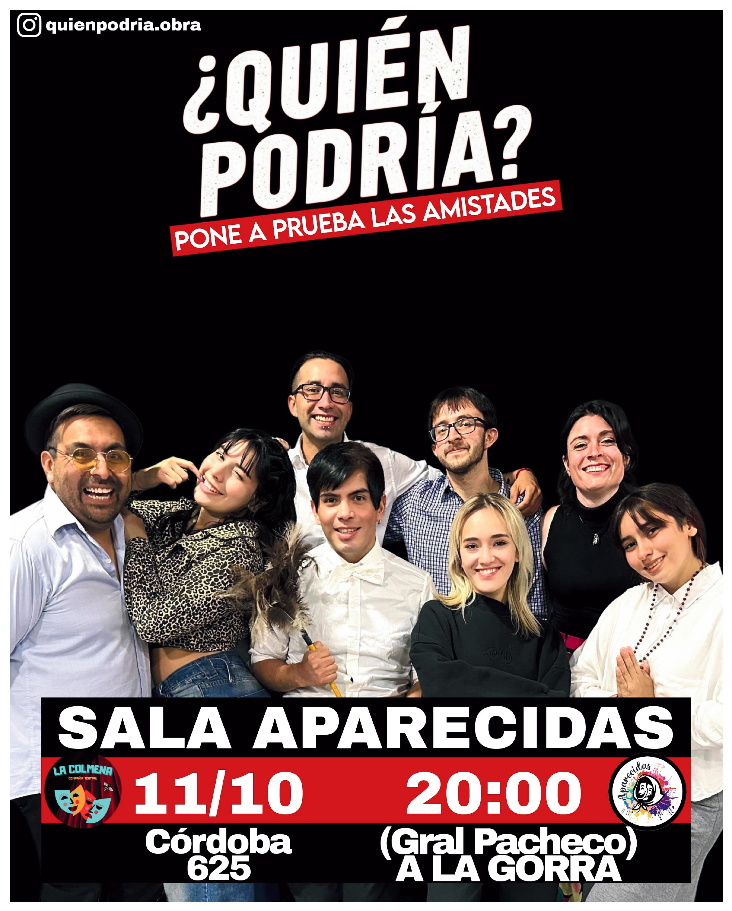

# 🎭 Quién Podría - Landing Page

**[🌐 Demo en Vivo](https://quien-podria-obra.netlify.app)**

## 📖 Sobre la Obra

**"Quién Podría"** es una comedia frenética que sigue a siete amigos durante una noche cualquiera donde un juego de cartas inocente se convierte en una revelación de secretos ocultos. Con traiciones disfrazadas de chistes, ex que reaparecen y un empleado que habla en guaraní, esta obra te hará reír, incomodar y salir preguntándote: *"¿Y yo... de cuál de este grupo seré?"*

### 🎪 Detalles del Espectáculo
- **Duración**: 65 minutos
- **Género**: Comedia moderna, coral, SIT COM
- **Compañía**: La Colmena Teatro

## ✨ Características del Sitio Web

### 🎨 Diseño y UX
- **Diseño responsive** adaptado a todos los dispositivos
- **Animaciones suaves** con efectos de scroll reveal
- **Carrusel interactivo** para mostrar los personajes
- **Optimización de rendimiento** con lazy loading de imágenes
- **SEO optimizado** con meta tags completos

### 📱 Funcionalidades
- **Reserva directa** vía WhatsApp con mensaje predefinido
- **Visualización de personajes** con carrusel táctil
- **Enlaces a redes sociales** (Instagram y TikTok)
- **Trailer integrado** con enlace a YouTube
- **Ubicación interactiva** con Google Maps
- **Analytics completo** con Google Analytics 4

### 🛠 Tecnologías Utilizadas

#### Frontend
- **React 18** - Biblioteca de interfaz de usuario
- **TypeScript** - Tipado estático para mayor robustez
- **Vite** - Build tool rápido y moderno
- **Tailwind CSS** - Framework de CSS utility-first
- **Lucide React** - Iconos modernos y ligeros

#### Herramientas de Desarrollo
- **ESLint** - Linting de código
- **PostCSS** - Procesamiento de CSS
- **Autoprefixer** - Compatibilidad entre navegadores

#### Analytics y Tracking
- **Google Analytics 4** - Seguimiento de usuarios y eventos
- **Eventos personalizados** para medir engagement

## 📊 Analytics y Métricas

El sitio incluye Google Analytics 4 configurado para trackear:

### Eventos Automáticos
- ✅ Vistas de página
- ✅ Clics en WhatsApp (reservas)
- ✅ Clics en trailer
- ✅ Clics en ubicación
- ✅ Clics en redes sociales
- ✅ Navegación por personajes

## 🎭 Personajes

La landing page presenta a los 8 personajes principales:

1. **Clara** - Interpretada por Camila
2. **CHORI** - Interpretado por Fher
3. **Octavio** - Interpretado por Luca
4. **Luna** - Interpretada por Anael
5. **Severino** - Interpretado por Emi
6. **Leticia** - Interpretada por Magali
7. **Pili** - Interpretada por Luana
8. **Pablo** - Interpretado por Mauro

## 📱 Responsive Design

El sitio está optimizado para:
- 📱 **Móviles** (320px+)
- 📱 **Tablets** (768px+)
- 💻 **Desktop** (1024px+)
- 🖥 **Pantallas grandes** (1440px+)

## 📞 Contacto y Reservas

### Información de Contacto
- **WhatsApp**: [+54 9 11 6562-2872](https://wa.me/5491165622872)
- **Instagram Compañía**: [@la_colmena_teatro](https://instagram.com/la_colmena_teatro)
- **Instagram Obra**: [@Quienpodria.obra](https://instagram.com/Quienpodria.obra)
- **TikTok**: [@Quienpodria.obra](https://tiktok.com/@Quienpodria.obra)

## 📄 Licencia

Este proyecto está bajo la Licencia MIT. 

## 🙏 Agradecimientos

- **La Colmena Teatro** - Por confiar en mi para su presencia digital
- **Comunidad teatral** - Por el apoyo constante

---

**¿Te animás a jugar?** 🎭

*Una comedia argenta frenética sobre secretos, traiciones y verdades incómodas.* 
